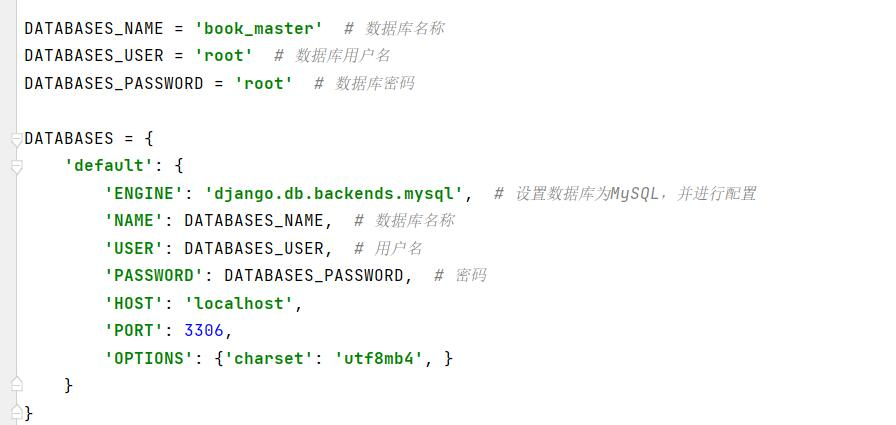

# Recommend-System
Design and implement an online book recommend system which based on CF algorithm.
基于协同过滤算法的图书推荐系统
系统基础功能：后台数据（用户、图书、留言）管理，在线浏览书籍，评论书籍，书籍评分，基于用户的个性化图书推荐等
## 1、修改book/settings.py中的数据库名称

```
先在本地mysql创建一个名为book_master的数据库
然后按以下图片所示找到相应位置，修改连接mysql的用户名与密码
```




## 2、创建虚拟环境

注意python解析器最好使用**3.6.6**的。


#### 2.1 直接使用`pro_venv`文件夹中的虚拟环境。

先把`pro_venv`中的`book-master`解压到当前文件夹。

然后pycharm打开项目。

左上角`File->settings->project:book-master->Python Interpreter->右上角设置小齿轮->Add->选中pro_venv\book-master\Scripts\python.exe`

如图：


## 3、数据迁移

### 3.1 创建表

打开Pycharm左下角的Terminal：


有括号，直接运行命令：

```
python manage.py migrate
```

如果 没有括号，则说明虚拟环境没有激活。

先把`pro_venv`中的`book-master`解压到当前文件夹(如果上面已经解压则无须再解压)，使用命令：

```
D:\pythonpro\git\book-master\pro_venv\book-master\Scripts\python.exe manage.py migrate
```

其中`D:\pythonpro\git\book-master`改为你的目录。

**注：**如果报错：`ImportError: Couldn’t import Django. Are you sure it’s installed and available on your PYTHONPATH environment variable? Did you forget to activate a virtual environment?`

解决方案如下：使用虚拟环境的python.exe的绝对路径执行。

`D:\pythonpro\git\book-master\pro_venv\book-master\Scripts\python.exe manage.py migrate`


### 3.2 创建缓存表

```
python manage.py createcachetable
```


### 3.3 创建超级管理员

等数据迁移完成后，创建超级管理员用于登录后台管理系统：

```
python manage.py createsuperuser
```

自行设置后台超级管理员账号与密码，后面登录时需要用到。


## 4、启动项目

```
打开Pycharm左下角的Terminal
输入命令
python manage.py runserver
```


如果没有出现括号，则说明虚拟环境 激活失败，这时候只能使用绝对路径来启动项目：

先把`pro_venv`中的`book-master`解压到当前文件夹(如果上面已经解压则无须再解压)，使用命令启动：

```
打开Pycharm左下角的Terminal
输入命令
D:\pythonpro\git\book-master\pro_venv\book-master\Scripts\python.exe manage.py runserver
```

其中`D:\pythonpro\git\book-master`改为你的目录。

启动项目后可能出现的错误:

```
raise ImproperlyConfigured('mysqlclient 1.3.13 or newer is required; you have %s.' % Database.__version__)
django.core.exceptions.ImproperlyConfigured: mysqlclient 1.3.13 or newer is required; you have 0.9.2.
```

解决方案，找到安装的django，django->db->base.py注释掉36、37行


## 5、上架图书

```
打开Pycharm左下角的Terminal
输入命令
python manage.py runserver
```

然后打开浏览器

```
输入地址
http://127.0.0.1:8000/create_book/
这个是生成一些常用的书籍
下面这个是后台手动上架图书
http://127.0.0.1:8000/admin/
```


## 6、进入用户访问界面

打开浏览器

```
输入地址
http://127.0.0.1:8000/
```

至此，整个项目运行完成
